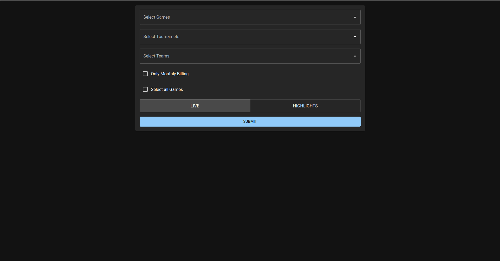
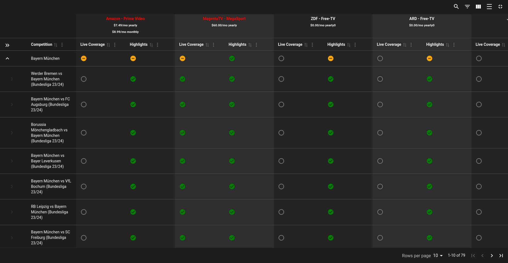

# gendev

A website to compare different streaming packages to watch your favorite football teams.


## Optimizations
The Problem is a variant of the weighted set cover. As we want to find the optimal solution we have to use a brute force algorithm to find the optimal solution(NP hard problem). We iterate over all possible combinations in ascending order by their price. To narrow down the search space we use the following optimizations:
- **Precomputation:** We precompute various indices and reverse indices, such as which packages cover specific games and which tournaments include particular games. This enables quick lookups and efficient validation of package coverage during the optimization process.
- **Pruning:** If a solution is more expensive than the current best solution, we can discard it. This is done with a simple comparison rather than subset checking.
- **Mandatory Packages:** If a game is only covered by one package, we know that we have to include this package in the solution.
- **Package Redundancy Check:** If two packages cover the same games, we can discard the more expensive one.
- **Efficient Representation:** We use bitsets instead of Hashsets as they are more memory-efficient and faster for subset checking. Since the game IDs have an upper bound, we can efficiently use bitsets for this purpose.
- **Incremental Combination Generation:** Instead of generating all possible combinations of packages at once, combinations are created incrementally. This reduces memory usage and allows for early pruning of non-optimal solutions.

## How to Run

### Using Docker

1. Make sure you have [Docker](https://docs.docker.com/get-docker/) installed.
2. Clone or download this repository.
3. Navigate to the project directory and run the following command:

   ```bash
   docker compose up
   ```
4. Access the application at [http://localhost:3000](http://localhost:3000).
### Running Locally

If you decide to run the application locally, it might be necessary to install `libssl-dev`:

```bash
sudo apt install libssl-dev
```
## Features

- **Optimal Solutions:** The algorithm delivers the best solution, **not** just an approximation (e.g., a greedy algorithm).
- **Package Minimization:** If two solutions are equally good, the one with fewer packages is chosen.
- **Detailed Preferences:** Specify preferences for watching games live, highlights, or both when choosing your favorite teams, games, and tournaments.
- **Billing Filters:** Filter results to show only monthly billed packages.
- **Highlighting:** The best combination of packages is highlighted in red.
- **Value Ranking:** Streaming packages are ranked and displayed by their value for money.
- **Efficient Handling:** Games not covered by any streaming package are ignored.

## Performance

Here are response times for sample queries:

- **Bayern Munich query:** 45.37 ms
- **Hatayspor, Deutschland, Bayern Munich, and Real Madrid query:** 831.00 ms
- **Oxford United, Los Angeles FC, AS Roma query:** 34.67 ms
- **All games:** 19.77 s
Tested on a Intel(R) Core(TM) i7-10750H CPU @ 2.60GHz with 16 GB RAM.
## Running Tests

To run the performance tests locally, execute the following command:

```bash
cargo test --release -- --show-output
```
## Roadmap

- **Subset Optimization:** Explore quick subset checking using a [Bitwise trie with bitmap](https://en.wikipedia.org/wiki/Bitwise_trie_with_bitmap). Currently, when comparing two possible solutions, we check if they cover the same required games. If so, we discard the more expensive one (see `handlers.rs`, line 145).
- **Sparse Bitsets:** Investigate hierarchical bitsets to address sparsity in the current bitsets. Use SIMD for subset and union operations where applicable.

## What It Looks Like

### Home Page


### Bayern Munich Results

